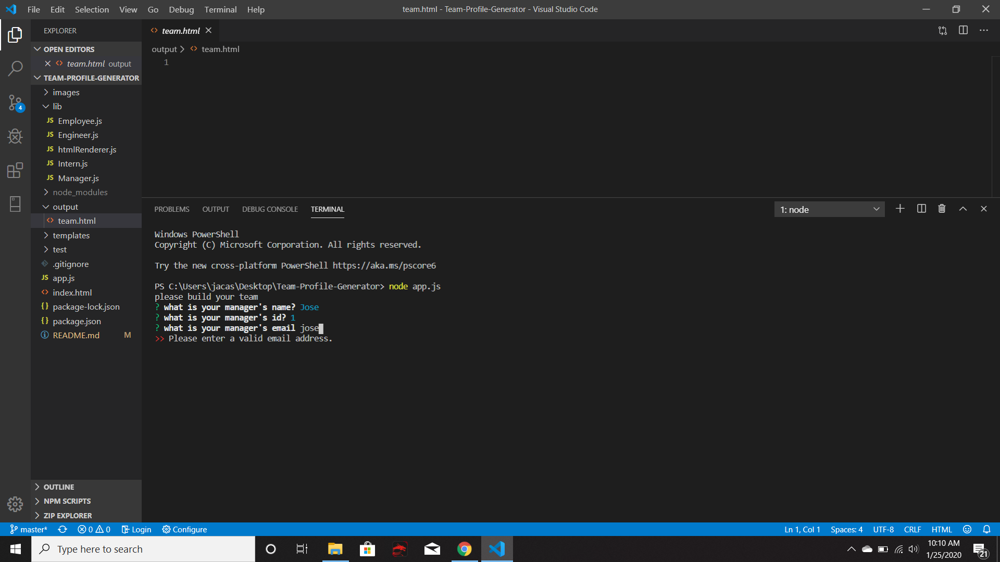

# Team-Profile-Generator
* The point of this application is to build a software engineering team generator command line application. The application will prompt the user for information about the team manager and then information about the team members. The user can input any number of team members, and they may be a mix of engineers and interns. The application will create an html that will show cards for each of the employees provided.

* Upon starting the command line, you are required to provide atleast the information for the manager, and then you can add multiple employees. You can choose from an engineer or an intern when adding extra employees.

## usage
* In order for the application to work, the users needs to install inquierer, for the prompts to ask the user for information.

* If another developer wants to run the tests provided, they also have to install jest.

## Built with
* npm package inquierer

* HTML templates

* javascript

* Bootstrap

## Description
* In this application I had to create templates for each of the employees that were options to be created.

* Also a template for the main set up of the html where the scripts were linked.

* Inquierer was also used multiple times in order to get all of the info needed to create the final html.

* Alot of functions and constructors were created in order to make the app work.

* The htmlrenderer.js file is the one which changes the templates and inputs the user information into them, and it is all sent to the output folder into the team.html file.

## Reocuring problems
* since there were a lot of functions and constructors, spelling mistakes were ocuring often.

* The terminal helped in solving a lot of problems, sometimes i would miss a letter and name something wrongly and the terminal would direct me straight to the problems.

* Getting the right information to the right places in the terminals would sometimes also be a problem because i would not send the right information to the right place resulting in the final html not making sense since instead of the id it would show the email or email instead of phonenumber.

## Usage Images
   In this image we see that the app passed all the tests:
* 
   Next we see how an email is required, and we also see that the team.html file is empty:
* 
   Now we show that there is a dropdown option for adding more employees:
* 
   For this I am only adding two extra workers and selecting the option to not add anymore:
* 
   This next image shows that the team.html filled once the app ended:
* 
   This last image shows how the team.html file looks in the browser:
* 